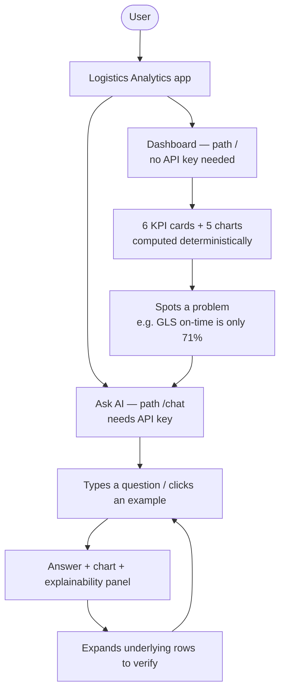
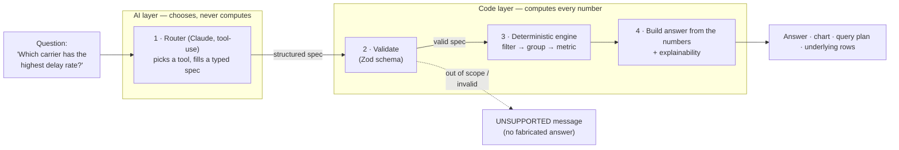
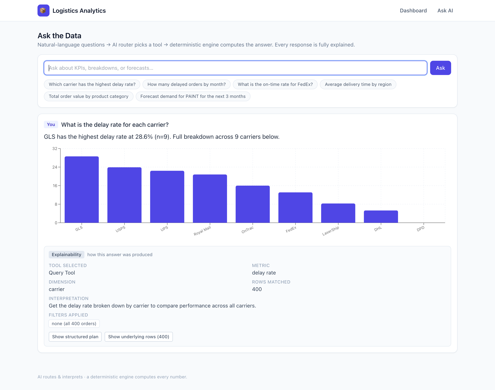
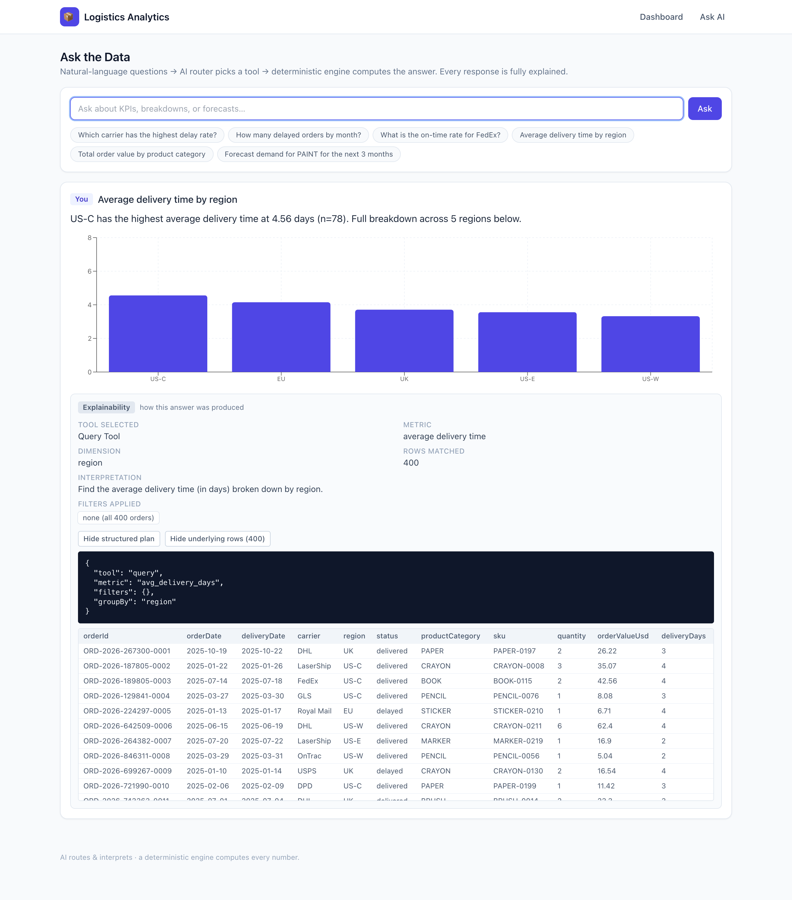
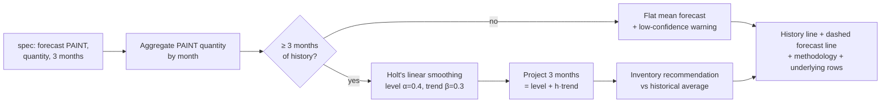
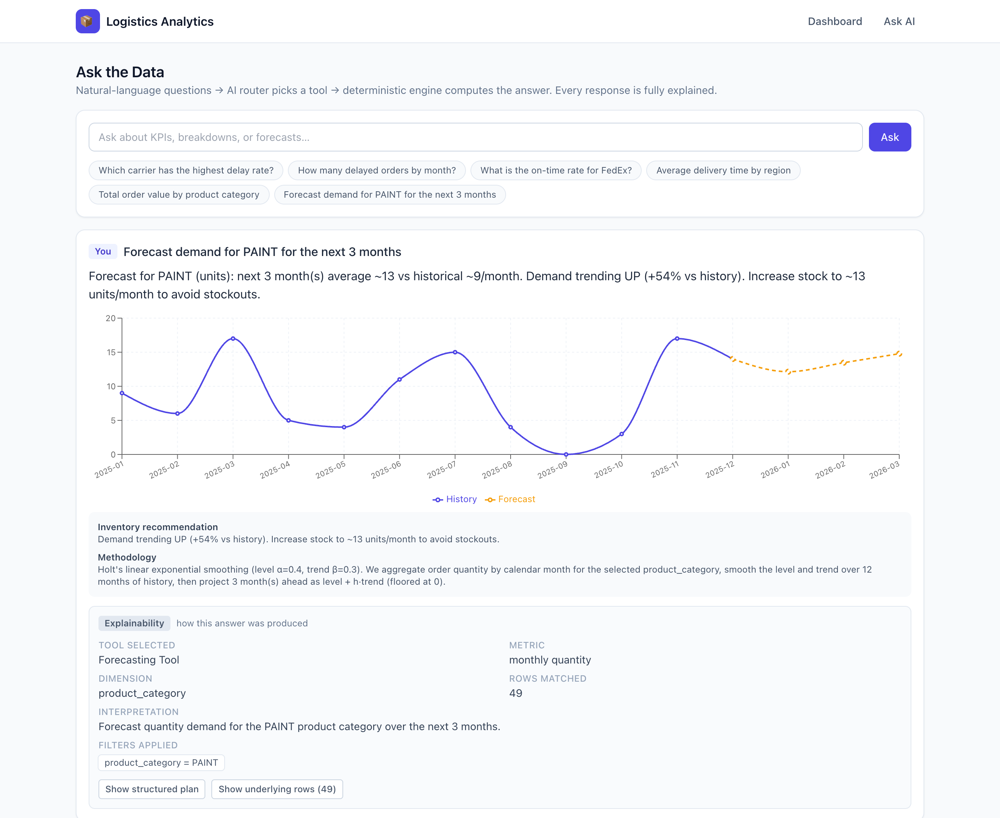
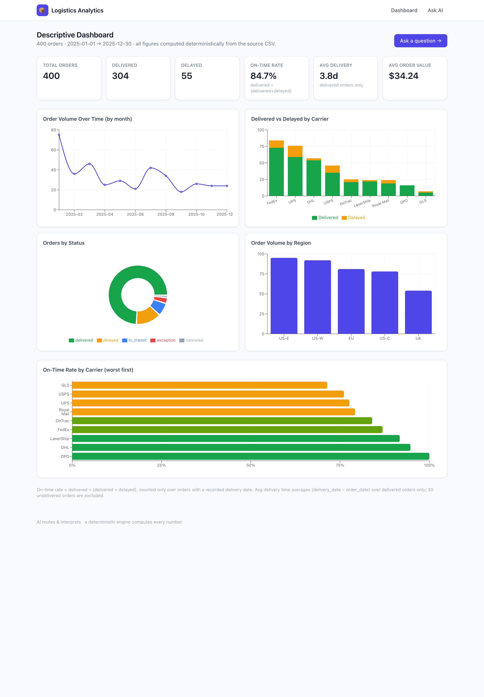

# AI-Powered Logistics Analytics Dashboard

A logistics analytics app over one read-only dataset (400 orders) with two interfaces:

1. **Descriptive dashboard** (`/`) — KPI cards + charts, all computed deterministically.
2. **Natural-language interface** (`/chat`) — ask a question; an AI **router** picks a tool
   and fills in a **structured query spec**, then a **deterministic engine** computes the
   answer. Every answer shows full explainability.

**The one rule that shapes everything:** the AI never produces a number. It only interprets
the question and fills in a typed spec; a separate computation layer produces every figure.

> ### AI usage disclosure
> This project was built with the assistance of an AI coding agent (Anthropic's Claude),
> used for scaffolding, implementation, tests, and documentation under my direction and
> review. All architectural decisions, the KPI/forecasting definitions, and the final code
> were reviewed and validated by me. Separately, at **runtime** the deployed app calls the
> Anthropic API only to *route* natural-language questions to a tool (it never computes
> values) — see [How it works](#how-it-works).

---

## Table of contents

1. [Quick start](#quick-start)
2. [Walkthrough — user journey & a worked example](#walkthrough--user-journey--a-worked-example)
3. [How it works](#how-it-works) — architecture, data flow, and the AI→compute boundary
4. [KPI definitions](#kpi-definitions)
5. [Forecasting](#forecasting)
6. [The dashboard](#the-dashboard)
7. [Project structure](#project-structure)
8. [Testing](#testing)
9. [Deployment](#deployment)
10. [Assumptions, limitations & future work](#assumptions-limitations--future-work)

---

## Quick start

```bash
npm install

# The dashboard works with no key. Only the /chat AI interface needs one:
cp .env.local.example .env.local        # then set ANTHROPIC_API_KEY=sk-ant-...

npm run dev        # http://localhost:3000
npm test           # run the data-correctness unit tests
```

No database, no build step beyond `npm`, no data import — the CSV is bundled in `data/`.

### Environment variables

| Variable            | Required | Default             | Purpose                          |
| ------------------- | -------- | ------------------- | -------------------------------- |
| `ANTHROPIC_API_KEY` | Yes\*    | —                   | The AI router (`/chat` only)     |
| `ANTHROPIC_MODEL`   | No       | `claude-sonnet-4-6` | Override the router model        |

\* **Only `/chat` needs a key.** The dashboard and all KPI/forecast computation run key-free,
so reviewers can use most of the app with no setup. The key is read from the env var and
never committed (`.env*.local` is git-ignored; only the `.env.local.example` placeholder is
tracked).

---

## Walkthrough — user journey & a worked example

### How a user moves through the app



Two doors into the **same data**: the dashboard is the "read the room" view; Ask AI is
the "ask a specific question" view. Both get every number from the same deterministic
engine.

### What happens on each question (the firewall)



**The key idea:** step 1 (AI) and step 3 (code) are firewalled. The AI decides *what* to
compute; the code decides *the value*. A bad AI guess can pick the wrong metric — it can
never invent a wrong number.

### Worked example — a Query

> **User asks:** *"Which carrier has the highest delay rate?"*

**1–2. The router emits this validated spec** (visible in the app's "structured plan"):

```json
{
  "tool": "query",
  "metric": "delay_rate",
  "groupBy": "carrier",
  "orderBy": { "direction": "desc" },
  "limit": 1
}
```

**3–4. The engine computes and the answer is assembled from the numbers:**

> **Answer:** "GLS has the highest delay rate at 28.6% (n=9)."
> **Chart:** bar of delay rate by carrier.
> **Explainability:** tool = Query · metric = delay rate · dimension = carrier ·
> filters = none · plan = *(the JSON above)* · underlying rows = *(the matching orders)*.

A breakdown question (here, *"delay rate for each carrier"*) renders the answer, a
chart, and the explainability summary:



Expanding **structured plan** and **underlying rows** shows the exact spec the engine
ran and the rows behind the number:



### Worked example — a Forecast

> **User asks:** *"Forecast demand for PAINT for the next 3 months."*



> **Answer:** "Forecast for PAINT (units): next 3 months average ~13 vs historical ~9/month.
> Demand trending UP (+54% vs history). Increase stock to ~13 units/month to avoid stockouts."
> Plus a chart with the solid history line flowing into the dashed forecast line, and the
> Holt's-smoothing methodology note.

---

## How it works

### The core idea: AI routes, code computes

LLMs are good at understanding fuzzy language but unreliable at arithmetic. So the AI's only
job is to **translate a question into a structured request**; a deterministic engine does the
math. This is the spec's central rule, and it's enforced two ways:

- **By prompt** — the system prompt forbids the model from stating any number.
- **By construction** — the model can only emit a typed spec via tool-use. It has no channel
  to return a computed figure, and the UI renders numbers *only* from the engine's output.
  The answer sentence a user reads is also generated from the computed numbers (not by the
  AI), so the prose can never contradict the data.

### Data flow

```
 data/mock_logistics_data.csv (READ-ONLY)
            │  parsed once, cached in memory as Order[]
            ▼
        lib/data.ts
            │
   ┌────────┴───────────────────────────────────┐
   │                                             │
 DASHBOARD (/)                          NL INTERFACE (/chat)
 server component calls                 question
 the compute layer directly               │
   │                                       ▼
   ▼                                  lib/ai/router.ts ── Claude ──┐  "interpret + pick a
 KPI cards + charts                   (tool-use, tool_choice=auto)  │   tool + fill the spec"
                                            │ ToolSpec (Zod-validated)
                                            ▼
                          ┌──────── DETERMINISTIC ENGINE ───────────┘
                          │  lib/compute/kpis.ts          (KPIs)
                          │  lib/compute/aggregations.ts  (Query Tool)
                          │  lib/compute/forecasting.ts   (Forecasting Tool)
                          └──────────────────┬───────────────────────
                                             ▼
                       answer (deterministic prose, lib/answer.ts)
                       + explainability (filters, plan, underlying rows)
```

The system has three cleanly separated layers — **(1) AI interpretation** (`lib/ai/`),
**(2) data computation** (`lib/compute/`), and **(3) business logic** (the KPI/forecast rules,
also in `lib/compute/`) — joined by **the typed spec** (`lib/query/spec.ts`) as the contract
between (1) and (2). The separation is what lets the entire compute layer be unit-tested with
no AI involved.

### No SQL — a typed query contract instead

Rather than executing AI-generated SQL (which the spec forbids), the AI fills in a
**Zod-validated discriminated union**: either a `QuerySpec` or a `ForecastSpec`. Every field
is an enum or a constrained value, and the model's output is **re-validated** before the
engine runs. Benefits: no injection or arbitrary computation, malformed specs are rejected
cleanly, and "unsupported" has a crisp definition — anything outside the schema simply can't
be expressed. The cost is that new capabilities need a code change (extend the enum + engine)
rather than a prompt tweak — a worthwhile trade for a bounded, testable analytics surface.

**The Query Tool** (`metric` + `filters` + optional `groupBy`/`orderBy`/`limit`):

```ts
{
  tool: "query",
  metric: "order_count" | "delayed_count" | "delivered_count" | "delay_rate"
        | "on_time_rate" | "avg_delivery_days" | "total_order_value"
        | "avg_order_value" | "total_quantity" | "avg_discount_pct",
  filters: { status?, carrier?, region?, productCategory?, sku?, warehouse?,
             isPromo?, dateFrom?, dateTo? },
  groupBy?: "carrier" | "region" | "product_category" | "status"
          | "warehouse" | "sku" | "week" | "month",
  orderBy?: { direction: "asc" | "desc" },
  limit?: number
}
```

**The Forecasting Tool:**

```ts
{
  tool: "forecast",
  dimension: "product_category" | "sku",
  dimensionValue: string,
  metric: "quantity" | "order_value",
  forecastMonths: 1..6   // default 3
}
```

### How a question is routed

The router (`lib/ai/router.ts`) calls Claude with these two tools and `tool_choice: auto`.
The system prompt lists the dataset's real values (5 statuses, 9 carriers, 5 regions, 8
categories, the date range) so the model maps phrasing onto canonical values — e.g.
*"highest X by Y"* → `metric=X, groupBy=Y, orderBy.direction=desc`. The model also returns a
one-sentence interpretation that's shown to the user.

If a question can't be served by these two tools (customer names, profit margin, weather —
anything not in the data), the model returns `UNSUPPORTED: …` and the UI shows that reason
instead of inventing an answer.

### Explainability (on every NL answer)

Each answer renders a panel ([`components/chat/ExplainPanel.tsx`](components/chat/ExplainPanel.tsx))
with: the **tool selected**, the **metric + dimension**, the **filters applied** (as chips),
the model's **interpretation**, the **exact structured plan** the engine executed, and the
**underlying rows** (table, first 50) with the total matched count.

---

## KPI definitions

All KPIs live in [`lib/compute/kpis.ts`](lib/compute/kpis.ts) and are verified against the
dataset in [`__tests__/compute.test.ts`](__tests__/compute.test.ts).

| KPI                        | Definition                                                                  | Value         |
| -------------------------- | --------------------------------------------------------------------------- | ------------- |
| Total orders               | `COUNT(*)`                                                                   | 400           |
| Delivered / Delayed        | `COUNT WHERE status = …`                                                     | 304 / 55      |
| In-transit / exception / canceled | `COUNT WHERE status = …`                                              | 27 / 11 / 3   |
| **On-time delivery rate**  | `delivered / (delivered + delayed)`, over non-null `delivery_date` only      | **84.7%**     |
| **Avg delivery time**      | `mean(delivery_date − order_date)` in days, over non-null `delivery_date`     | **3.83 days** |
| Avg order value            | `mean(order_value_usd)` over all orders                                      | $34.24        |
| Total revenue              | `sum(order_value_usd)` over all orders                                       | $13,696       |

**The judgment calls** (the spec left these to me):

- **The on-time denominator is `delivered + delayed`, not all orders.** A `delayed` order
  counts as not-on-time; `in_transit`, `exception`, and `canceled` have unknown or
  not-applicable timeliness, so including them would distort the rate.
- **The 30 null delivery dates are excluded** from on-time rate and avg delivery time — you
  can't measure the timeliness of an order that hasn't arrived. They're still counted in
  totals and status counts.
- **Delivery time** is the integer day difference, computed in **UTC** to avoid DST drift.
  (The data has no negative delivery times.)
- **Consistency:** this on-time/delay logic is implemented once and reused by the KPI card,
  the `on_time_rate`/`delay_rate` query metrics, and every per-group breakdown — so the
  dashboard, an NL answer, and the carrier chart can never disagree.

---

## Forecasting



Implemented in [`lib/compute/forecasting.ts`](lib/compute/forecasting.ts).

**Method — Holt's linear exponential smoothing** (level `α = 0.4`, trend `β = 0.3`): aggregate
the chosen metric (`quantity` or `order_value`) by calendar month for the selected
category/SKU, smooth the level and trend over the history, then project `forecastMonths`
ahead as `level + h·trend` (floored at 0). Returns the forecast values, a combined
history+forecast chart, an inventory recommendation, and a methodology note.

**Why this method:** there are at most ~12 monthly points per series. ARIMA/Prophet over-fit
at that length and add heavy dependencies; a flat moving average can't express a trend.
Holt's adds a single trend term so the forecast drifts sensibly, and it stays fully
deterministic and explainable.

**Sparse-data fallback:** with **355 distinct SKUs across 400 rows**, most SKUs appear 1–2
times, so a per-SKU monthly series is mostly noise. A series with **< 3 months** of history
falls back to a flat mean forecast with an explicit low-confidence **warning**. Category-level
forecasts (8 dense categories) are the meaningful default, and the router prefers
`product_category` unless a single SKU is named.

**Inventory rule:** compare forecast monthly average to historical — `>+10%` → increase stock;
`<−10%` → reduce; else hold — phrased with the target monthly volume.

---

## The dashboard



KPI cards plus five charts, each on a distinct dimension so nothing is redundant:

1. **Order volume over time** (line, by month)
2. **Delivered vs delayed by carrier** (stacked bar — absolute volume)
3. **Orders by status** (donut)
4. **Order volume by region** (bar)
5. **On-time rate by carrier** (horizontal bar, worst-first, color-graded)

Chart 5 is the key analytical view: charts 1–4 are counts/volumes, and the stacked carrier
chart makes the highest-*volume* carrier look worst. Chart 5 normalizes that into the on-time
*rate*, revealing the real reliability laggard (GLS) versus the best (DPD/DHL). It reuses the
existing `on_time_rate` metric and ties directly to the on-time KPI card.

The dashboard is a **Server Component** that calls the compute layer directly — no client
fetch, no loading spinner.

---

## Project structure

```
app/
  page.tsx                 Dashboard (server component → compute layer directly)
  chat/page.tsx            NL interface
  api/kpis/route.ts        Dashboard data (pure computation, no AI)
  api/query/route.ts       NL endpoint: router → engine → answer + explainability
lib/
  data.ts                  CSV → in-memory Order[] (cached, frozen, read-only)
  types.ts                 Order, KpiSummary
  query/spec.ts            Zod typed query/forecast contracts (the AI's surface)
  compute/kpis.ts          KPI definitions
  compute/aggregations.ts  Query Tool: filter / group / metric engine
  compute/forecasting.ts   Forecasting Tool: Holt smoothing + fallback + inventory rec
  ai/router.ts             AI orchestrator (Anthropic tool-use → validated spec)
  answer.ts                Deterministic answer prose + filter descriptions
components/
  dashboard/KPICards.tsx, Charts.tsx
  chat/ChatInterface.tsx, ExplainPanel.tsx, ResultChart.tsx
data/mock_logistics_data.csv   (READ-ONLY)
__tests__/compute.test.ts      17 unit tests on the deterministic layer
```

**Stack:** Next.js 14 (App Router) + TypeScript + Tailwind + Recharts + the Anthropic SDK.
Next.js gives the UI and API in one Vercel-deployable unit; TypeScript is what makes the
"typed query contract" real and catches schema/engine drift at build time.

---

## Testing

```bash
npm test
```

17 unit tests cover the data correctness that's worth 20% of the grade — written **before** the
UI, against golden values from the real dataset: exact status counts, the 30 null delivery
dates, no negative delivery times, the on-time/avg-delivery definitions, query-engine
invariants (group-by sums to the total, rate bounds, sort order, chronological months,
date-range filtering, manual-sum checks), and forecasting behavior (horizon length, the
sparse-SKU warning, unknown-dimension handling). Because the compute layer is AI-free, every
number is validated with `npm test` alone — no API key required.

---

## Deployment

Deploys to any Node host. For **Vercel**:

1. Push to GitHub and import the repo (auto-detected as Next.js).
2. Add `ANTHROPIC_API_KEY` in the project's environment variables.
3. Deploy. The CSV ships in `data/`, so there's nothing else to provision.

There's no auth, so reviewers need no credentials.

---

## Assumptions, limitations & future work

**Assumptions & simplifications**

- **In-memory store.** 400 rows fit in memory and scan sub-millisecond, so the "queryable
  store" is a cached, frozen `Order[]`. This keeps the compute layer free of SQL and means
  zero provisioning — at the cost of not scaling to millions of rows.
- **Stateless NL interface** — each question is independent (no multi-turn follow-ups).
- **Exact-match filters** (case-insensitive) — the router is prompted with canonical
  spellings rather than doing fuzzy matching.
- **Monthly forecast granularity**, 1–6 month horizon, default 3.
- **No auth** — the spec only requires it if added, and it's pure friction for a read-only demo.

**Limitations & unsupported queries**

- **`/chat` needs `ANTHROPIC_API_KEY`.** Without it, `/chat` returns a clear error; the
  dashboard and all computation still work.
- **Only the two tools' surface is supported.** Anything outside the typed contract —
  customer names, profit/margin, costs, weather, correlations, "why" questions — returns an
  `UNSUPPORTED:` response rather than a guess.
- **Per-SKU forecasts are low-confidence** given the sparsity (handled with a fallback +
  warning, but inherently noisy). **No forecast confidence intervals** (point forecasts only).

**Future improvements**

- Swap the in-memory store for DuckDB/SQLite *behind the same typed spec*, so scaling up
  doesn't change the AI boundary.
- Forecast prediction intervals and seasonal decomposition once more history exists.
- Multi-turn conversational follow-ups ("…now break that down by region").
- A router eval harness asserting that a battery of phrasings maps to the expected specs
  (the compute layer is already covered).
- Fuzzy "did you mean" resolution for misspelled carriers/categories.

---

### Overall tradeoff

Targeting ~6–10 hours, I prioritized **correctness and the architectural boundary** over
polish: a unit-tested deterministic core, a strict typed AI→compute contract, and clear
explainability — rather than a database, extra chart eye-candy, theming, or auth. The simplest
store (in-memory array) and the simplest defensible forecast (exponential smoothing with a
documented fallback) were deliberate choices to keep the system easy to read, verify, and
deploy.
